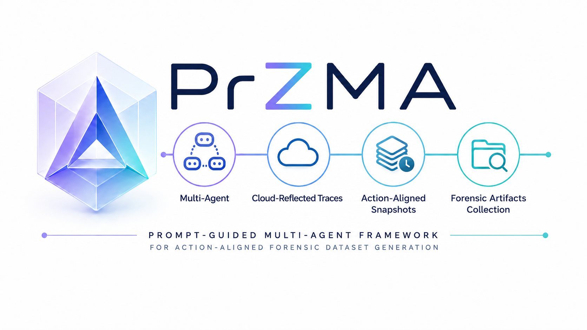
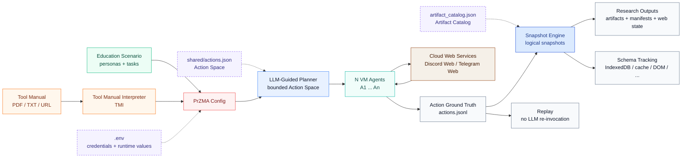

# PrZMA

**Prompt-Guided Zero-Touch Multi-Interaction Agent for Generating Forensic Datasets in Multi-Platform Environments**

<p align="center">
  
</p>

[](#)
[](#requirements)
[](#requirements)
[](#requirements)
[](#requirements)
[](#requirements)
[](#end-to-end-replay-no-llm)
[](#license-and-citation)

This repository is the official implementation of **PrZMA**, submitted to **DFRWS APAC 2026**.

**PrZMA is a zero-touch forensic dataset generation framework for cloud-connected, multi-platform environments.** It uses LLM-guided agents to execute bounded user actions in isolated Windows VMs, records every action as ground truth, and captures logical snapshots that preserve the local artifacts and interface state produced by those actions.

The framework is intended to make three research tasks practical without relying on private real-world case data:

| Research Need | PrZMA Support |
|---|---|
| Privacy-safe forensic education datasets | Generates realistic multi-user activity and action-aligned artifacts for training and coursework. |
| Forensic tool validation | Uses Tool Manual Interpreter (TMI) and Target Mode to derive tool-relevant actions and artifacts from tool specifications. |
| Cloud artifact/schema evolution analysis | Uses All Mode, Full Trigger execution, web-state capture, and schema-tracking databases to observe how cloud-reflected browser artifacts change across actions, UI paths, and service updates. |

Together, these components connect **what the agent did**, **what the user interface showed**, and **what artifacts were materialized locally**, making the resulting datasets easier to interpret, replay, and compare across application versions.

<details>
<summary>Table of Contents</summary>

- [Overview](#overview)
- [Demo](#demo)
- [System Architecture](#system-architecture)
- [Key Features](#key-features)
- [Execution Modes](#execution-modes)
- [Cloud-Reflected Schema Tracking](#cloud-reflected-schema-tracking)
- [Action Space and Execution Model](#action-space-and-execution-model)
- [Multi-Layer Artifact Collection](#multi-layer-artifact-collection)
- [Supported Applications and Scenarios](#supported-applications-and-scenarios)
- [Repository Structure](#repository-structure)
- [Execution Entrypoints](#execution-entrypoints)
- [Configuration Files](#configuration-files)
- [Output Layout](#output-layout)
- [Requirements](#requirements)
- [Quick Start](#quick-start)
- [End-to-End Replay No LLM](#end-to-end-replay-no-llm)
- [Full Trigger Mode Tool Testing](#full-trigger-mode-tool-testing)
- [Schema Tracking Example Telegram Web IndexedDB](#schema-tracking-example-telegram-web-indexeddb)
- [Sample Outputs](#sample-outputs)
- [Research Artifact Notes](#research-artifact-notes)
- [License and Citation](#license-and-citation)

</details>

## Overview

PrZMA treats dataset generation as a coordinated multi-agent activity rather than a fixed script. An LLM-guided controller assigns bounded actions to multiple VM-based agents, lets them interact with cloud web services as independent users, and records the resulting forensic state as action-aligned evidence.



The result is a dataset where the action log, user-visible interface state, locally materialized cloud artifacts, and schema changes can be interpreted together.

PrZMA separates the **purpose of a run** from the **execution strategy**:

| Run Purpose | Configuration Path | What It Produces |
|---|---|---|
| **Education** | A user-defined scenario config specifies personas, VM agents, shared tasks, and snapshot policy. | Realistic multi-user activity with action-aligned artifacts for teaching, exercises, and controlled demonstrations. |
| **Tool Testing** | TMI reads a target tool manual and derives artifact requirements, action boundaries, and snapshot rules. | Tool-oriented datasets for checking whether forensic tools recover expected artifacts and for observing schema coverage or drift. |

Execution strategies such as **Target Mode** and **All Mode** are described below; they determine whether PrZMA runs focused scenario/tool actions or broader UI-triggering coverage.

## Demo

This demo runs [`przma_education_config.json`](przma_education_config.json) in a realistic forensic triage scenario.

Three investigators meet in a Discord channel:

- **Alice (Agent1)**: team leader who coordinates triage and assigns tasks.
- **Bob (Agent2)**: browser cache and timeline specialist.
- **Eve (Agent3)**: OSINT-oriented analyst who cross-checks Discord storage artifacts.

During execution, the Snapshot Engine performs time-based and action-based logical snapshots, collecting artifacts such as:

- `chromium.cache.cache_data`
- `webapp.discord.chromium.storage`

[](https://www.youtube.com/watch?v=Efwjz-u-Uwo)

## System Architecture

PrZMA runs as a host-and-VM framework:

| Component | Role |
|---|---|
| `Tool_Manual_Interpreter` | Converts tool manuals or specifications into artifact requirements and action boundaries. |
| `Automation_Agent` | Uses the configured Action Space, scenario, personas, and LLM responses to select executable actions. |
| `VM_Agent` | Runs inside each Windows VM and executes browser, Discord Web, Telegram Web, and snapshot operations. |
| `Snapshot_Engine` | Monitors action logs and trigger rules, collects logical snapshots, and records snapshot metadata. |
| `endToEndReplay.py` | Replays structured action logs without re-invoking the LLM. |

The host controller writes structured action logs. The Snapshot Engine uses those logs to align snapshots with user actions, preserving the causal relationship between interactions and generated forensic artifacts.

## Key Features

### Tool Manual Interpreter (TMI)

TMI converts unstructured forensic tool documentation, such as PDF, TXT, or web pages, into structured execution guidance:

- Supported services and platforms.
- Target artifact types.
- Tool-relevant action boundaries.
- PrZMA configuration for tool-driven dataset generation.

### Prompt-Guided Automation Agent

The Automation Agent executes interactions using an LLM-driven planner inside a bounded Action Space:

- Multi-user and multi-agent coordination.
- Browser-based services such as Discord Web and Telegram Web.
- Structured action logging for ground truth.
- Zero-touch execution after configuration.

### Logical Snapshot Engine

The Snapshot Engine captures forensic artifacts based on:

- Time-based triggers.
- Action-based triggers.
- Platform-aware VM-side path resolution.
- Snapshot manifests that record trigger, time, artifact category, and collected paths.


### Replay-Based Reproducibility

PrZMA can replay a recorded execution from `actions.jsonl` without asking the LLM to regenerate decisions. Replay uses stored action names, parameters, timing gaps, and snapshot policies to reproduce the end-to-end flow.

## Execution Modes

PrZMA supports two execution modes that serve different research and validation goals.

| Mode | Purpose | How It Works | Typical Use |
|---|---|---|---|
| **Target Mode** | Generate artifacts relevant to a scenario or a forensic tool specification. | The agent executes a bounded subset of actions selected from the Action Space. For tool testing, TMI derives required artifacts and action boundaries from the target tool manual. | Education scenarios, tool-directed dataset generation, regression testing. |
| **All Mode** | Observe broad application behavior and induce schema expansion. | The system inspects interface-level representations such as HTML/DOM, identifies clickable UI components, and systematically triggers accessible functionality with action-level snapshots. | Cloud web application coverage, schema drift observation, Full Trigger experiments. |

This distinction is important for cloud-connected services. A Target Mode run can generate focused artifacts for a known validation goal, while an All Mode run can reveal new or changing client-side structures introduced by application updates or previously untriggered UI paths.

In the implementation, All Mode behavior is exposed through the Full Trigger workflow:

- `run_full_trigger`: enables systematic UI triggering in tool-testing runs.
- `target_application`: binds the run to a specific cloud web application such as `discord_web` or `telegram_web`.
- `browser.full_trigger_click`: records action-level UI triggering events.
- `capture_web_state`: stores interface and client-side schema context for later comparison.

## Cloud-Reflected Schema Tracking

Cloud services often materialize evidence locally through browser storage rather than through traditional standalone application files. PrZMA tracks these cloud-reflected artifacts by collecting browser-side state after selected actions and normalizing schema observations across snapshots.

Schema tracking uses action-aligned snapshots to preserve:

- **What happened**: structured action logs with agent ID, action name, parameters, timestamp, and rationale.
- **What the user saw**: screenshots, HTML source, and DOM representations.
- **What was materialized locally**: IndexedDB, Local Storage, Session Storage, CacheStorage, Code Cache, and Chromium Cache artifacts.
- **How structures changed**: schema-tracking databases that compare object stores, fields, and artifact structures across snapshots or runs.

This is particularly useful for Discord Web and Telegram Web, where server-side updates can change local artifact structures without local software installation events. PrZMA therefore supports both action-induced schema expansion and longitudinal schema drift observation.

## Action Space and Execution Model

PrZMA represents executable user behavior as a JSON-based Action Space. Each action includes a semantic description and parameter schema, and maps to VM-side automation modules.

Representative actions include:

| Category | Examples |
|---|---|
| Browser | `browser.launch`, `browser.goto`, `browser.smart_click`, `browser.smart_type`, `browser.scroll`, `browser.screenshot` |
| Discord Web | `discord.login`, `discord.goto_channel`, `discord.send_message`, `discord.reply_message`, `discord.react_message`, `discord.upload_file` |
| Telegram Web | `telegram.open`, `telegram.select_chat`, `telegram.send_message`, `telegram.upload_file` |

The LLM selects and parameterizes actions at runtime based on the scenario, persona, current state, and artifact-generation goals. This keeps behavior flexible while preventing arbitrary tool use outside the defined execution boundary.

## Multi-Layer Artifact Collection

PrZMA collects multi-layer forensic artifacts through action-triggered logical snapshots. Instead of relying only on full disk imaging, it captures browser, cloud-reflected, and system layers while preserving realistic interaction-driven traces.

### Browser Artifacts Chromium-Based

| Layer | Artifact Category | Collected Items |
|---|---|---|
| Browser | Core Profile Data | History, Cookies, Login Data, Preferences, Secure Preferences, Bookmarks, Web Data |
| Browser | Web Storage | IndexedDB, Local Storage, Session Storage |
| Browser | Service Worker | Service Worker storage |
| Browser | Cache | CacheStorage, HTTP Cache, Cache_Data |
| Browser | Execution Cache | Code Cache, JavaScript bytecode |
| Browser | Network Metadata | Network state, TransportSecurity, Reporting/NEL |

### Cloud-Reflected Web Application Artifacts

| Layer | Application | Collected Artifacts |
|---|---|---|
| Cloud-Reflected | Discord Web | IndexedDB, Local Storage, Session Storage, Service Worker, CacheStorage, Code Cache |
| Cloud-Reflected | Telegram Web | IndexedDB, Local Storage, Session Storage, Service Worker, CacheStorage, Code Cache |

### System Artifacts Windows

| Layer | Category | Collected Items |
|---|---|---|
| System | Event Logs | Windows Event Logs, EVTX |
| System | Execution Traces | Prefetch, Amcache, SRUM |
| System | Registry Source | NTUSER.DAT, UsrClass.dat, SYSTEM, SOFTWARE, SAM, SECURITY |
| System | User Activity | Recent Items, LNK, Jump Lists |
| System | Filesystem | User Downloads folder |
| System | Tasks and Services | Scheduled Tasks XML, service configuration |
| System | Temporary Data | User/System Temp directories, rule-limited |

## Supported Applications and Scenarios

PrZMA currently focuses on web-centric forensic scenarios:

- **Chromium-based browsing**
  - Google Chrome and Microsoft Edge.
  - Search, navigation, scrolling, clicking, screenshots, and downloads.

- **Cloud-based messaging web applications**
  - Discord Web: multi-agent conversations, file exchange, and Full Trigger execution.
  - Telegram Web: web-based interaction and schema tracking support.

These scenarios reproduce artifact footprints commonly examined in modern investigations where local browser state reflects cloud-service activity.

## Repository Structure

PrZMA is organized as a research pipeline. The host-side modules decide what should happen, the VM-side module performs the actions, and the snapshot module records action-aligned forensic state.

| Area | Path | Responsibility |
|---|---|---|
| Planning and execution | [`Automation_Agent/`](Automation_Agent) | LLM-guided action selection, VM coordination, action logging, and execution flow control. |
| Tool-oriented generation | [`Tool_Manual_Interpreter/`](Tool_Manual_Interpreter) | Manual ingestion, tool-plan generation, and tool-testing configuration derivation. |
| Artifact collection | [`Snapshot_Engine/`](Snapshot_Engine) | Logical snapshot triggering, artifact catalog resolution, schema tracking, and cache dump support. |
| VM-side runtime | [`VM_Agent/`](VM_Agent) | RPyC service for browser automation, Discord/Telegram actions, and snapshot collection inside each Windows VM. |
| Shared definitions | [`shared/`](shared) | Action definitions, schemas, artifact descriptors, and host/VM wire formats. |
| Research samples | [`End to End Samples/`](End%20to%20End%20Samples) | Selected outputs for education, replay, full-trigger execution, and tool validation. |
| Scenario examples | [`Scenario Prompt Samples/`](Scenario%20Prompt%20Samples) | Example scenario prompts and configuration snippets. |

## Execution Entrypoints

The repository contains several runnable files because PrZMA supports multiple research workflows. The recommended entrypoints are listed below in order of typical use.

| Entrypoint | Mode | Workflow | Use When | Output |
|---|---|---|---|---|
| [`przma_education.ps1`](przma_education.ps1) | Target | Education scenario launcher | Running the included multi-agent Discord triage scenario. | `runs/run_PrZMA_Education/` |
| [`przma_tooltest.ps1`](przma_tooltest.ps1) | Target | TMI-driven tool testing | Deriving an artifact-generation run from a forensic tool manual. | `interpreter_out/<run_id>/`, then `runs/run_<run_id>/` |
| [`przma_discord_full_trigger.ps1`](przma_discord_full_trigger.ps1) | All | Discord Full Trigger launcher | Exercising Discord Web UI actions for schema expansion experiments. | `runs/run_<run_id>/` |
| [`przma_telegram_full_trigger.ps1`](przma_telegram_full_trigger.ps1) | All | Telegram Full Trigger launcher | Exercising Telegram Web UI actions for schema tracking experiments. | `runs/run_<run_id>/` |
| [`endToEndReplay.py`](endToEndReplay.py) | Replay | LLM-free replay | Re-executing a recorded action log for reproducibility checks. | `runs/run_<replay_run_id>/` |
| [`main.py`](main.py) | Core | Core orchestrator | Running a fully specified PrZMA config directly. | `runs/run_<run_id>/` |
| [`VM_Agent/setup.ps1`](VM_Agent/setup.ps1) | VM setup | VM-side bootstrap | Preparing a copied VM Agent directory by creating `.venv`, installing dependencies, and installing Playwright Chromium. | VM-local `.venv/`, `vm_agent_config.json` |
| [`VM_Agent/init.ps1`](VM_Agent/init.ps1) | VM startup | Scheduled task registration | Registering `agent_main.py` to run automatically at VM startup after setup. | Windows scheduled task `PrZMA_VM_Agent` |

For most users, `przma_education.ps1`, `przma_tooltest.ps1`, and `endToEndReplay.py` are the primary interfaces. `main.py` is the underlying host-side orchestrator used by the launcher scripts.

## Configuration Files

PrZMA separates runtime values, scenario configuration, action knowledge, and artifact knowledge. These inputs are combined by the host orchestrator when a run starts.

| Group | File | Role |
|---|---|---|
| Runtime environment | [`.env.example`](.env.example) | Public template for API keys, VM credentials, service accounts, meeting/channel targets, and optional parser paths. Copy to `.env` locally. |
| Scenario / run config | [`Config(templete).json`](Config%28templete%29.json) | Minimal template describing agents, VM boot, discovery, scenario, execution mode, and snapshot policy fields. |
| Scenario / run config | [`przma_education_config.json`](przma_education_config.json) | Complete education scenario used by the demo launcher. |
| Action knowledge | [`shared/actions.json`](shared/actions.json) | Action Space referenced by the LLM-guided planner. It defines executable action names, descriptions, parameter schemas, and artifact hints. |
| File/action inputs | [`shared/file.json`](shared/file.json) | File catalog used by upload-oriented actions, such as evidence notes, IOC lists, and timeline files. |
| Artifact knowledge | [`Snapshot_Engine/artifact_catalog.json`](Snapshot_Engine/artifact_catalog.json) | Logical artifact catalog used by snapshot policies to resolve browser, web application, cloud-reflected, and system artifacts. |

Runtime-generated files such as `Snapshot_Engine/rules.json`, `Snapshot_Engine/vm_endpoints.json`, `runs/`, and `interpreter_out/` are ignored by Git.

Mode-related fields are intentionally explicit in the configuration:

| Field | Meaning |
|---|---|
| `purpose` | Selects the high-level workflow, currently `education` or `tool_testing`. |
| `run_full_trigger` | Enables All Mode style UI triggering in tool-testing runs. |
| `target_application` | Binds a run to a cloud web application such as `discord_web` or `telegram_web`. |
| `snapshot.event_trigger.on_actions` | Defines which actions cause logical snapshots, such as `browser.full_trigger_click`. |
| `snapshot.collection_plan.capture_web_state` | Captures screenshots, HTML/DOM state, and IndexedDB schema context for schema tracking. |
| `snapshot.collection_plan.artifacts` | Selects browser, web application, cloud-reflected, or system artifacts from the artifact catalog. |

## Output Layout

PrZMA output directories are designed to keep action ground truth, collected artifacts, and derived schema data together.

```text
runs/
  run_<run_id>/
    actions.jsonl
    actions.summary.json
    snapshots/
      snap_<snapshot_id>/
    schema_tracking_<run_id>.db
```

| Output | Meaning |
|---|---|
| `actions.jsonl` | Ordered ground-truth action log with agent IDs, action names, parameters, and timestamps. |
| `actions.summary.json` | Human-readable summary of the recorded action sequence. |
| `snapshots/` | Action- or time-triggered logical snapshots collected from VM agents. |
| `schema_tracking_<run_id>.db` | SQLite database used for cross-snapshot schema tracking when enabled. |
| `interpreter_out/<run_id>/` | TMI outputs such as `tool_plan.json`, `interpreted_przma_config.json`, and `tmi_rules.json`. |

When `capture_web_state` is enabled, snapshots may also include interface and schema context such as screenshots, HTML, DOM, and IndexedDB schema files. These records are used to compare client-side structures across actions and across executions.

## Requirements

- Windows host with VMware Workstation.
- Python 3.10 or newer.
- Multiple Windows VMs for multi-agent scenarios.
- Playwright with Chromium installed.
- OpenAI API access for LLM-guided planning and tool manual interpretation.
- Service accounts for Discord Web or prepared Telegram Web sessions, depending on the scenario.

Install Python dependencies:

```powershell
python -m pip install -r requirements.txt
python -m playwright install chromium
```

For VM-side setup, use [`VM_Agent/setup.ps1`](VM_Agent/setup.ps1) after copying the `VM_Agent/` directory into each VM. The VM setup script creates its own virtual environment and installs Playwright Chromium inside the VM.

## Quick Start

### 1. Configure Environment Variables

Create a local `.env` from the example file:

```powershell
Copy-Item .env.example .env
```

Fill in the values needed for your experiment:

- `OPENAI_API_KEY`, `OPENAI_MODEL`
- `VM_PASSWORD`
- `DISCORD_A*_EMAIL`, `DISCORD_A*_PASSWORD`
- `DISCORD_MEETING_CHANNEL`
- `TELEGRAM_MEETING_CHAT`
- `TMI_TOOL_NAME`, `TMI_TOOL_VERSION`, `TMI_TOOL_MANUAL_URL`, `TMI_TOOL_MANUAL_PATH`
- `PRZMA_CCL_CHROMIUM_CACHE`, optional Chromium cache parsing script path

### 2. Prepare VM Agents

For each Windows VM:

1. Copy [`VM_Agent/`](VM_Agent) into the VM.
2. Run the VM setup script:

```powershell
cd "C:\Users\VM Agent\VM_Agent"
Set-ExecutionPolicy -Scope Process Bypass -Force
.\setup.ps1
```

3. Start the VM-side RPyC service:

```powershell
.\.venv\Scripts\python.exe .\agent_main.py
```

To register the VM Agent to start automatically at boot:

```powershell
.\setup.ps1 -RegisterStartup
```

For VM-side details, see [`VM_Agent/README.md`](VM_Agent/README.md).

### 3. Run a Reference Scenario

```powershell
.\przma_education.ps1
```

Equivalent direct command:

```powershell
python .\main.py `
  --config .\przma_education_config.json `
  --run-id PrZMA_Education `
  --rules .\Snapshot_Engine\rules.json `
  --catalog .\Snapshot_Engine\artifact_catalog.json `
  --out-dir .\runs
```

Outputs are written under:

```text
runs/run_<run_id>/
```

This launcher is the easiest way to inspect the end-to-end pipeline because it uses the included education configuration and writes outputs to the standard `runs/run_<run_id>/` layout.

### 4. Run Tool-Testing Mode

```powershell
.\przma_tooltest.ps1 `
  -RunId przma_tooltest_01 `
  -ToolName ChromeCacheView `
  -ToolManualPath .\manuals\ChromeCacheView.txt `
  -TemplateConfig ".\Config(templete).json"
```

TMI outputs are written under:

```text
interpreter_out/<run_id>/
```

The interpreted PrZMA configuration is then passed into `main.py` for tool-oriented artifact generation.

## End-to-End Replay No LLM

PrZMA includes an end-to-end replay module, [`endToEndReplay.py`](endToEndReplay.py), that replays previously recorded action logs without using an LLM.

Replay preserves:

- VM boot and discovery flow.
- Recorded action order.
- Source timestamp gap replay.
- Snapshot behavior through the Snapshot Engine.
- Credential restoration for masked login actions via `.env`.

Replay example:

```powershell
python .\endToEndReplay.py `
  --actions-log ".\End to End Samples\Replay Mode\PrZMA_Education\actions.jsonl" `
  --config .\przma_education_config.json `
  --run-id PrZMA_Education_Replay
```

Replay outputs are written to:

- `runs/run_<replay_run_id>/actions.jsonl`
- `runs/run_<replay_run_id>/snapshots/...`

## Full Trigger Mode Tool Testing

Full Trigger is the implementation path used for All Mode style experiments.

The goal is to induce schema expansion by triggering conditionally generated artifacts across a cloud web application. In this workflow, a logical snapshot is executed at each Full Trigger action.

For each action-level snapshot, PrZMA:

- Collects HTML source, DOM structure, and rendered screenshots.
- Performs logical snapshots of browser storage, including IndexedDB, LevelDB, and Chromium Cache.
- Parses selected artifacts with external parsers such as `ccl_chromium_reader`, when configured.
- Stores structured results in `schema_tracking_<run_id>.db`.

### Discord Snapshot Comparison

Three Full Trigger executions were performed on Discord Web:

- `discord_ft1`: baseline execution.
- `discord_ft2`: additional standard interactions.
- `discord_ft3`: thread creation and interaction.

**Cache Diff: `discord_ft1` vs `discord_ft2`**


Entries labeled `ft2_only` represent cache artifacts generated exclusively by additional interactions.

**Schema Change: `discord_ft1` vs `discord_ft3`**


Newly observed fields include:

- `message_reference`
- `reactions`
- `referenced_message`
- `sticker_items`

The channel ID remained unchanged, indicating structural expansion within an existing entity rather than entity creation.

## Schema Tracking Example Telegram Web IndexedDB

PrZMA applies the same Tracking DB infrastructure to cloud-synchronized web applications.

The figure below shows the Tracking DB generated from a Telegram Web snapshot captured in February 2026.


Even within a single snapshot, structural heterogeneity is observable across IndexedDB object stores. Because Telegram Web reflects cloud-synchronized data, structural changes may occur due to server-side updates, not only local interactions.

This example demonstrates that PrZMA supports:

- Action-induced schema expansion.
- Time-based structural drift detection.
- Validation of forensic tools against evolving web application schemas.

## Sample Outputs

Selected outputs are provided under [`End to End Samples/`](End%20to%20End%20Samples):

| Sample Area | Included Artifacts | Demonstrates |
|---|---|---|
| `Education/` | Action logs, summary logs, and snapshots. | Multi-agent scenario execution and action-aligned artifact collection. |
| `Replay Mode/` | Original education run and replayed action logs. | LLM-free replay reproducibility from recorded actions. |
| `All Execution Mode/` | Full-trigger outputs, snapshots, cache dumps, and schema-tracking databases. | Action-level snapshotting and schema expansion analysis. |
| `Tool Validation/` | ChromeCacheView-oriented TMI outputs and external tool result samples. | Tool-manual-driven configuration and tool-output comparison. |

See [`End to End Samples/README.md`](End%20to%20End%20Samples/README.md) for details.

## Research Artifact Notes

- This repository contains a proof-of-concept research implementation rather than a packaged end-user application.
- Full VM-based execution requires local VMware configuration, VM credentials, network discovery, and service-account preparation.
- The `.env` file should not be published with real credentials. Use [`.env.example`](.env.example) and keep local secrets untracked.
- Full Trigger launchers are convenience wrappers around generated Full Trigger configurations. If config-builder helper scripts are not included in a checkout, use the sample Full Trigger configurations under [`End to End Samples/All Execution Mode/`](End%20to%20End%20Samples/All%20Execution%20Mode) or prepare equivalent configs manually.
- Telegram Web behavior can depend on persistent browser sessions and server-side updates, so schema changes may reflect remote service evolution as well as local user actions.
- Logical snapshots are intended to preserve action-aligned forensic state; they are not a replacement for full disk images in all forensic workflows.

## Typical Use Cases

- **Forensic education**
  - Generate clean, reproducible datasets for training and coursework.
  - Avoid privacy and legal issues associated with real user data.

- **Forensic tool testing**
  - Validate whether a tool detects known interactions.
  - Compare tool outputs against action-level ground truth.

- **Research and benchmarking**
  - Study artifact drift across browser or application versions.
  - Evaluate forensic tool coverage and limitations.
  - Preserve version-specific schema observations for later analysis.

## License and Citation

The license for this research artifact is not specified yet. Before public release, add a repository-level `LICENSE` file that matches the intended distribution policy.

If you use PrZMA in academic work, please cite the paper and/or the software citation metadata in [`CITATION.cff`](CITATION.cff).
