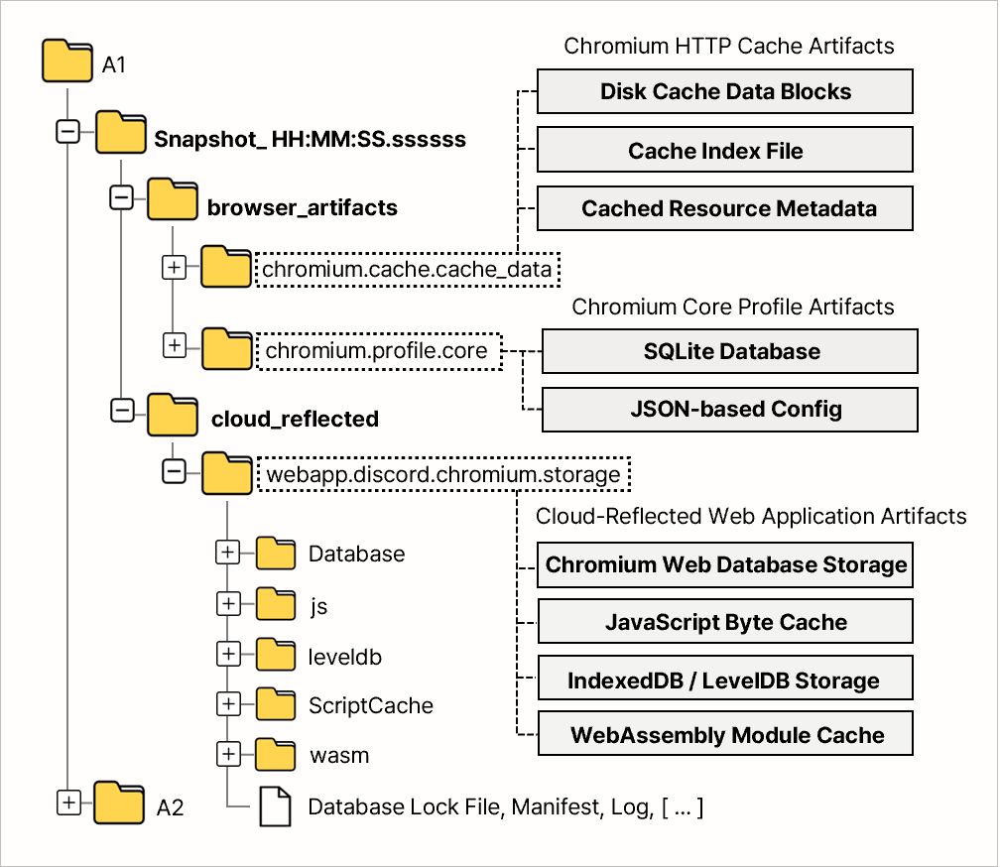
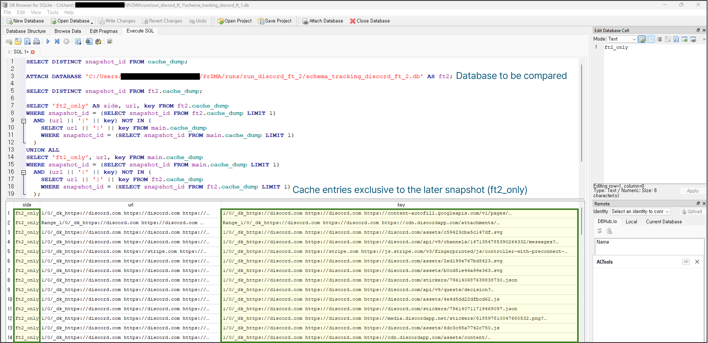
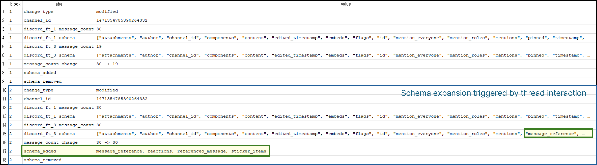
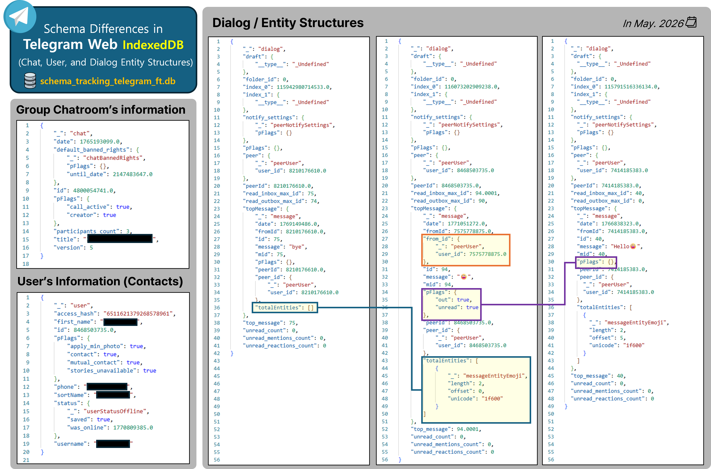

# [DFRWS APAC 2026] PrZMA  
**Prompt-Guided Zero-Touch Multi-Interaction Agent for Generating Forensic Datasets in Multi-Platform Environments**

This repository is the **official repository** of *PrZMA*, a framework submitted to **DFRWS APAC 2026**.  
PrZMA leverages **LLM-driven planning and automation** to generate **reproducible, action-grounded digital forensic datasets** across **multi-user, multi-platform environments**.

<details>
<summary>📑 Table of Contents</summary>

- [Overview](#-overview)
- [Demo](#-demo)
- [Key Features](#key-features)
- [Multi-Layer Artifact Collection](#multi-layer-artifact-collection)
- [Supported Applications & Scenarios](#supported-applications--scenarios)
- [Repository Structure](#-repository-structure)
- [Requirements](#requirements)
- [End-to-End Replay](#-end-to-end-replay-no-llm)
- [Full Trigger Mode (Tool Testing)](#-full-trigger-mode-tool-testing)
- [Schema Tracking Example](#-schema-tracking-example-telegram-web-indexeddb)
- [Typical Use Cases](#-typical-use-cases)

</details>

## 🔍 Overview

Digital forensic research/education and tool validation require realistic, well-documented datasets.  
However, real-world data is difficult to share due to privacy, legal, and ethical constraints.

**PrZMA** addresses this challenge by introducing a **Prompt-Guided, Zero-Touch automation framework** that:

- Interprets **forensic tool manuals** using an LLM
- Automatically executes **human-like interactions** across browsers and services through prompt-guided agents
- Captures **logical snapshots** of forensic artifacts at controlled points in time
- Produces **tool-ready datasets** for education, evaluation, and regression testing

PrZMA is designed for **both education-oriented scenarios** and **forensic tool testing workflows**, without requiring manual interaction during execution.

## 🎬 Demo
This demo runs `przma_education_config.json` in a realistic forensic triage scenario.

Three investigators meet in a Discord channel:
- **Alice (Agent1)** – Team leader. Coordinates the triage, assigns tasks, and keeps the discussion focused.
- **Bob (Agent2)** – Browser cache & timeline specialist. Verifies Chromium artifacts and execution traces.
- **Eve (Agent3)** – OSINT-oriented analyst. Cross-checks Discord storage artifacts and challenges assumptions.
  
They conduct a short, time-boxed investigation:
- Alice assigns roles and sets priorities.
- Bob and Eve perform web lookups to verify artifact locations.
- One agent uploads an evidence-style file (e.g., IOC list, timeline CSV).
- The discussion ends with a concise triage plan.

During execution, the Snapshot Engine performs **time-based and action-based logical snapshots**, collecting:

- `chromium.cache.cache_data`
- `webapp.discord.chromium.storage`

The demo illustrates how PrZMA generates realistic, role-driven interactions and reproducible forensic artifacts under controlled snapshot policies.

[](https://www.youtube.com/watch?v=DVqMYSUfUdE)

## Key Features

- **Tool Manual Interpreter (TMI)**  
  Converts unstructured forensic tool documentation (PDF / web pages) into a structured execution plan:
  - Supported services and platforms  
  - Target artifact types  
  - Action boundaries and constraints  

- **Prompt-Guided Automation Agent**  
  Executes interactions using an LLM-driven planner with a strictly bounded action space:
  - Multi-user and multi-agent coordination  
  - Browser-based services (e.g., Discord Web, Telegram Web)  
  - Zero-touch execution after initial configuration  

- **Logical Snapshot Engine**  
  Captures forensic artifacts based on:
  - Time-based triggers  
  - Action-based triggers  
  - Platform-aware path resolution (VM-side)  
  An example snapshot output is shown below:
  <p align="center">
    
  </p>

- **Dual-Purpose Design**
  - **Education**: realistic analyst-style interactions and artifact generation  
  - **Tool Testing**: reproducible datasets for validating forensic tools and detecting artifact drift  
    - **Full Trigger Mode**: Exhaustively activates UI elements and performs action-level logical snapshots to induce functionality-driven artifact schema changes
  - **Replay**: Re-executes recorded end-to-end action sequences from structured action logs **without re-invoking the LLM**

---

## Multi-Layer Artifact Collection

PrZMA collects **multi-layer forensic artifacts** through **action-triggered logical snapshots**.  
Instead of full disk imaging, the system captures artifacts across **browser**, **cloud-reflected**,  
and **system** layers, preserving realistic interaction-driven traces.

### 🌐 Browser Artifacts (Chromium-Based)

| Layer | Artifact Category | Collected Items |
|------|------------------|-----------------|
| Browser | Core Profile Data | History, Cookies, Login Data, Preferences, Secure Preferences, Bookmarks, Web Data |
| Browser | Web Storage | IndexedDB, Local Storage, Session Storage |
| Browser | Service Worker | Service Worker storage |
| Browser | Cache | CacheStorage, HTTP Cache (Cache_Data) |
| Browser | Execution Cache | Code Cache (JavaScript bytecode) |
| Browser | Network Metadata | Network state, TransportSecurity, Reporting/NEL |

### ☁️ Cloud-Reflected Web Application Artifacts

Local browser-side traces of cloud services accessed via web applications.

| Layer | Application | Collected Artifacts |
|------|------------|---------------------|
| Cloud-Reflected | Discord Web | IndexedDB, Local Storage, Session Storage, Service Worker, CacheStorage, Code Cache |
| Cloud-Reflected | Telegram Web | IndexedDB, Local Storage, Session Storage, Service Worker, CacheStorage, Code Cache |

### 🖥️ System Artifacts (Windows)

Artifacts reflecting system-level execution and user interaction.

| Layer | Category | Collected Items |
|------|---------|-----------------|
| System | Event Logs | Windows Event Logs (EVTX) |
| System | Execution Traces | Prefetch, Amcache, SRUM |
| System | Registry (Source) | NTUSER.DAT, UsrClass.dat, SYSTEM, SOFTWARE, SAM, SECURITY |
| System | User Activity | Recent Items (LNK), Jump Lists |
| System | Filesystem | User Downloads folder |
| System | Tasks & Services | Scheduled Tasks (XML), Service configuration |
| System | Temporary Data | User/System Temp directories (rule-limited) |

---

## Supported Applications & Scenarios

PrZMA currently focuses on **web-centric forensic scenarios**, including:

- **Web Browsing (Chromium-based)**
  - Google Chrome / Microsoft Edge  
  - Search, navigation, scrolling, clicking, downloads  

- **Cloud-based Messaging (Web Applications)**
  - Discord Web: multi-agent conversations, file exchange, and Full Trigger execution  
  - Telegram Web: experimental support for web-based interaction and schema tracking

These scenarios are sufficient to reproduce **realistic artifact footprints** commonly examined in modern investigations.

---

## 🗂️ Repository Structure

**`Automation_Agent/`**  
- Executes LLM-planned actions within a strictly defined action boundary.
- Coordinates VM agents, action selection, action logging, and execution flow control.

**`Tool_Manual_Interpreter/`**  
- Interprets tool manuals or specifications to derive required interactions and target artifacts.
- Generates tool-testing configurations and artifact-oriented action boundaries.

**`Snapshot_Engine/`**  
- Manages action- or time-triggered logical snapshots.
- Resolves artifact catalog entries and collects configured browser, application, system, and cloud-reflected artifacts.

**`VM_Agent/`**  
- Runs inside the target VM and performs actual interactions such as browser automation, Discord Web actions, and artifact collection.
- **Note**: All paths are used as-is inside the VM environment. Please refer to the VM Preparation section below.

**`shared/`**  
- Common schemas, action definitions, artifact catalogs, and wire formats shared across components.

**`main.py`**  
- Entry point that initializes the PrZMA pipeline and coordinates interpreter, automation agent, VM agents, and snapshot execution.

**`Config.json`**  
- Configuration template for dataset generation and tool-testing workflows.

**`przma_config.json`**  
- Unified configuration describing agents, platforms, scenarios, credentials, execution modes, and snapshot policies.

**`przma_education.ps1`**  
- Launcher script for education-oriented multi-agent scenarios.

**`przma_tooltest.ps1`**  
- Launcher script for tool-testing and validation workflows.

**`przma_discord_full_trigger.ps1`**  
- Launcher script for Discord Web Full Trigger mode, which systematically activates detectable UI functionality and performs action-level logical snapshots.

**`przma_telegram_full_trigger.ps1`**  
- Launcher script for Telegram Web Full Trigger mode, used to exercise Telegram Web functionality and collect action-aligned schema tracking artifacts.

**`endToEndReplay.py`**  
- Replays previously recorded `actions.jsonl` logs without re-invoking the LLM.
- Reuses stored action names, parameters, timestamps, and snapshot policies to reproduce an end-to-end execution flow.

---

## Requirements

- Windows host with VMware Workstation
- Python 3.10+
- Playwright (Chromium-based browsers)
- OpenAI API access for LLM-guided planning and tool manual interpretation
- Multiple Windows VMs for multi-agent scenarios

### Environment Configuration

Before running PrZMA, fill in the provided `.env` file with the credentials and runtime values required for your experiment. This includes the LLM API key/model, VM password, target service accounts, rendezvous channel or chat information, and tool-validation metadata for TMI workflows.

Required values may include:
- `OPENAI_API_KEY`, `OPENAI_MODEL`
- `VM_PASSWORD` (the VM path is configured separately in `Config.json`)
- `DISCORD_A*_EMAIL`, `DISCORD_A*_PASSWORD` (extend the same naming pattern for additional agents)
- `DISCORD_MEETING_CHANNEL` (Discord Web channel URL for the target scenario)
- `TELEGRAM_MEETING_CHAT` (Telegram chat title or username)
- `TMI_TOOL_NAME`, `TMI_TOOL_VERSION`, `TMI_TOOL_MANUAL_URL`, `TMI_TOOL_MANUAL_PATH` (URL-based or local PDF/TXT tool manual)
- `PRZMA_CCL_CHROMIUM_CACHE` (optional Chromium cache parsing script path)

### VM Preparation

For multi-agent execution, PrZMA requires **Windows virtual machines configured identically to the host environment**.

1. Create one or more Windows VMs using VMware Workstation  
   (same OS version and browser environment as the host is recommended).

2. Inside each VM, copy the `VM_Agent/` directory to the root path: `C:\VM_Agent\`

3. From an elevated PowerShell session inside the VM, initialize the agent by running: `init.ps1`

4. Once initialized, the VM Agent runs in the background and waits for commands from the host-side controller.

Each VM represents an independent agent and can participate in multi-user or multi-platform scenarios. (For most scenarios, users only need to modify `przma_config.json`.)

## 🔁 End-to-End Replay (No LLM)

PrZMA includes an end-to-end replay module, `endToEndReplay.py`, that replays previously recorded action logs (`actions.jsonl`) without using an LLM.

- Reuses the same VM boot/discovery flow as normal execution (`..._config.json`-driven)
- Replays actions in recorded order with source timestamp gap replay
- Preserves snapshot behavior by running `Snapshot_Engine` during replay
- Supports credential restoration for masked login actions (e.g., Discord) via `.env`

### Replay Inputs

- `--actions-log`: source action log to replay (e.g., `runs/run_<id>/actions.jsonl`)
- `--config`: configuration used for the original run (agents, VM boot, snapshot rules)
- `--run-id` (optional): replay run identifier

### Replay Run Example

```powershell
python .\endToEndReplay.py `
  --actions-log .\runs\run_PrZMA_Education\actions.jsonl `
  --config .\przma_education_config.json `
  --run-id PrZMA_Education_Replay
```
Replay outputs are written to:
- `runs/run_<replay_run_id>/actions.jsonl`
- `runs/run_<replay_run_id>/snapshots/...`

## ⚙️ Full Trigger Mode (Tool Testing)

In Tool Testing mode, PrZMA provides a **Full Trigger** strategy designed to systematically activate all detectable UI functionality within a bounded Action Space.

The primary goal of Full Trigger is to **induce schema expansion** by triggering conditionally generated artifacts across the service.

A **Logical Snapshot is executed at every action (action-level snapshotting).**

For each action-level snapshot, PrZMA:
- Collects HTML source, DOM structure, and rendered screenshots  
- Performs a logical snapshot of browser storage (IndexedDB, LevelDB, and Chromium Cache), parses the artifacts using `ccl_chromium_reader`
- Stores the structured results in a Tracking DB managed in the format `schema_tracking_{run_id}.db`

This enables quantitative, action-aligned cross-snapshot comparison.

### 🔎 Demonstration: Discord Snapshot Comparison

Three Full Trigger executions were performed on Discord Web:

- `discord_ft1` : Baseline execution  
- `discord_ft2` : Additional standard interactions  
- `discord_ft3` : Thread creation and interaction  

All results were stored in the Tracking DB and compared using SQLite.


**Cache Diff (`discord_ft1` vs `discord_ft2`)**



Entries labeled `ft2_only` represent cache artifacts generated exclusively by additional interactions.

**Schema Change (`discord_ft1` vs `discord_ft3`)**





Newly observed fields:
- `message_reference`
- `reactions`
- `referenced_message`
- `sticker_items`

The channel ID remained unchanged, indicating **structural expansion within an existing entity** rather than entity creation.

These results confirm that Full Trigger execution induces object-level schema expansion.

## 🗄️ Schema Tracking Example: Telegram Web IndexedDB

PrZMA applies the same Tracking DB infrastructure to **cloud-synchronized web applications**.

The figure below shows the Tracking DB generated from a Telegram Web snapshot captured in **February 2026**.



Even within a single snapshot, structural heterogeneity is observable across IndexedDB object stores.

Because Telegram Web reflects cloud-synchronized data, structural changes may occur due to **server-side updates**, not only local interactions.

The same scenario will be re-executed one month later to observe longitudinal schema drift. 

This demonstrates that PrZMA supports:
- Action-induced schema expansion  
- Time-based structural drift detection  
- Validation of forensic tools against evolving web application schemas  


## 🎓 Typical Use Cases

- **Forensic Education**
  - Generate clean, reproducible datasets for training and coursework  
  - Avoid privacy and legal issues of real user data  

- **Forensic Tool Testing**
  - Validate whether a tool correctly detects known interactions  
  - Compare tool outputs against known ground-truth actions  

- **Research & Benchmarking**
  - Study artifact drift across browser or application versions  
  - Evaluate forensic tool coverage and limitations  

